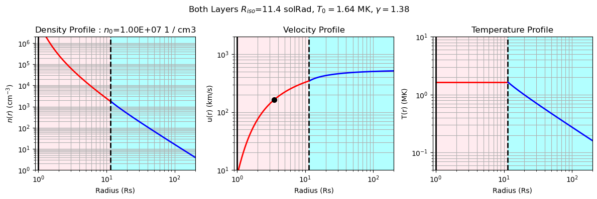

## ParkerSolarWind

This repository contains code which solves the hydrodynamic equations for an expanding trans-sonic flow under a spherically symmetric gravitational force,  which is Eugene Parker's theory of the solar wind ([Parker 1958](https://ui.adsabs.harvard.edu/abs/1958ApJ...128..664P/abstract), [Parker 1960](https://ui.adsabs.harvard.edu/abs/1960ApJ...132..821P/abstract)).

This code follows closely the recent derivation by [Shi et al. (2022)](https://ui.adsabs.harvard.edu/abs/2022PhPl...29l2901S/abstract) and has greatly benefited also from the discussion in [Dakeyo et al. (2022)](https://ui.adsabs.harvard.edu/abs/2022ApJ...940..130D/abstract).

There are two main files here `parkersolarwind.py` and `plot_parkersolarwind.py`. The former contains the functions to solve the equations themselves, while  the latter contain functions to plot the different types of solutions. The solver engine is `scipy.optimize.root`. 

There are three types of solutions :

* An isothermal solar wind (`parkersolarwind.solve_parker_isothermal`) <details><p> - This follows [Parker 1958](https://ui.adsabs.harvard.edu/abs/1958ApJ...128..664P/abstract), in which the solar wind fluid is held at a fixed temperature. Mass flux conservation results in a negative density gradient and in turn an outwards directed pressure gradient force. For sufficiently hot $T_0$, this outwards force outcompetes gravitation, resulting in a trans-sonic solar wind flow out to infinity. While such a constant temperature is non-physical in the heliosphere, it is a reasonable first approximation to behavior in the solar corona where coronal heating operates.</p></details>
* A polytropic solar wind (`parkersolarwind.solve_parker_polytropic`) <details><p> - This follows [Parker 1958](https://ui.adsabs.harvard.edu/abs/1958ApJ...128..664P/abstract) and [Shi et al. (2022)](https://ui.adsabs.harvard.edu/abs/2022PhPl...29l2901S/abstract). Here, the solar wind temperature is allowed to cool with heliocentric distance, as is observed to actually occur in the solar wind (e.g. [Dakeyo et al. (2022)](https://ui.adsabs.harvard.edu/abs/2022ApJ...940..130D/abstract). The cooling is parameterized by a polytropic index $1 \lt \gamma \lt 5/3$. However, as shown by  [Parker 1960](https://ui.adsabs.harvard.edu/abs/1960ApJ...132..821P/abstract) and [Shi et al. (2022)](https://ui.adsabs.harvard.edu/abs/2022PhPl...29l2901S/abstract), a transonic polytropic solution valid for all radii $R\gt1R_\odot$ is only analytically possible over a small region of $(\gamma-T_\odot)$ space where $T_\odot$ is the temperature at the coronal base. Moreover, the values of $\gamma$ and $T_\odot$ for which solutions exist result in both an unphysically high coronal temperature, and a cooling profile which is too shallow to explain the observed solar wind temperature profiles.</details></p> 
* An ''isothermal-layer'' solution (`parkersolarwind.solve_isothermal_layer`) <details><p> - This follows [Shi et al. (2022)](https://ui.adsabs.harvard.edu/abs/2022PhPl...29l2901S/abstract) and [Dakeyo et al. (2022)](https://ui.adsabs.harvard.edu/abs/2022ApJ...940..130D/abstract) and consists of an initial isothermal layer out to some boundary distance $R_{\text{iso}}$, which can nominally be interpreted as defining a corona as the region in which coronal heating (as an abstract physical process) operates. For $R\gt R_{\text{ISO}}$, the solar wind is constrained to follow a polytropic solution which is initialized by the outer boundary conditions of the isothermal layer. For most combinations of physical conditions, the trans-sonic critical point is located within the isothermal layer. As long as the isothermal boundary is sufficiently high that the solar wind stays super-sonic at the (unphysically sharp) transition to polytropic behavior, the solution remains on the asymptotically accelerating solution branch and a reasonable solar wind solution is obtained (see e.g. Rivera+ (In Prep)). </details></p>

Each of these solution functions returns an array of heliocentric distances, mass densities, fluid velocities and fluid temperatures, as well as any parameters that went into the solution.

Units are tracked with `astropy.units` and the outputs of the above functions are `astropy.units.Quantity` objects.

`plot_parkersolarwind` subsequently contains plotting functions which are expecting these same output arrays and parameters. 

In the following example, we solve and plot an isothermal layer solution :

```python
import parkersolarwind as psw
import plot_parkersolarwind as plot_psw
import numpy as np
import astropy.units as u
sol = psw.solve_isothermal_layer(
    np.logspace(0,np.log10(200),400)*u.R_sun, # Radial grid points
    11.5*u.R_sun, # Isothermal layer outer radius
    1.64*u.MK, # Isothermal layer temperature
    1.38, # Polytropic layer polytropic index
    rho0=11e6*(const.m_p/2)/u.cm**3 # Density normalization
) 
fig,axes=plot_psw.plot_isothermal_layer(sol)
```


Examples for the other two types of solution as a function of varying input parameters can be seen in `ExampleNotebook.ipynb`

As of this commit (2/6/2023) : 

* The average corpuscular mass defaults to $\mu=0.5$ but may be tweaked as a parameter to the solve functions
* (Future enhancement) Radial flux tube expansion is assumed throughout all space 
* (Known Issue) For `solve_parker_polytropic` No check is currently done that the input parameters lie in the allowed region of $(T_\odot-\gamma)$ space ([Shi et al. (2022)](https://ui.adsabs.harvard.edu/abs/2022PhPl...29l2901S/abstract)), so it is possible to generate an all-NaN solution for this reason.
* (Known Issue) For `solve_parker_polytropic`, there are some numerical instability issues which can result in solutions in the wrong branch or all-NaN solutions. This is likely due to the implementation of `scipy.optimize.root` with which we currently integrate from $1R_\odot$ outwards and use the previous solution as the initial guess, except at the critical point where we enforce the guess to jump to above the critical speed. A future implementation should integrate explicitly from the critical point down and up separately with adaptive radial grid spacing and the local solution gradient should be used to imrpove the guess.
